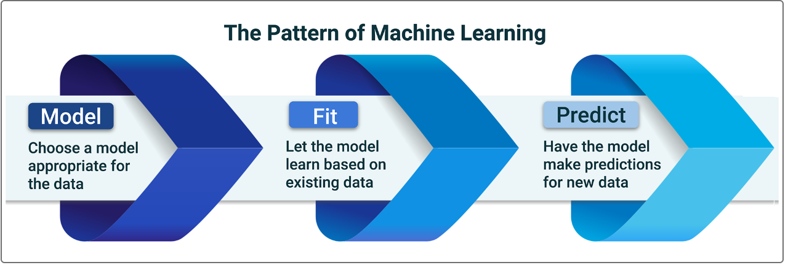

# Loans Credit Quality Prediction

## Overview of the Analysis: 

> Purpose of the analysis:

An increasing number of the financial institutions is using mavchine learning models to assess the credit risk of their portfolios. To do that successfully, an optimal machine learning model must be selected. 
Our analysis is focusing on the techniques that can be used to select the right model by performing the following steps:

- Assess the available client data;
- Select the models appropriate for the available dataset and the goal we want to achieve by utilizing the models;
- Apply the models and evaluate the output;
- Select one model based on the evaluation scores and substanciate our choice. 

> Available financial information and the goal of the model: 

- Data review: 
  Below is the sample of the financial information we have about the loans and the loan applicants that will be used as an input to the model (all columns except the last one 'loan status' - we call this data the _features_), and the last column, the content of which our model will be predicting based on the _features_ (this column, 'loan status' will be referred to as the _target_): 

   
  Please note, the target contains 0s and 1th, where 0 will indicate the healthy loans and 1th - high-risk loans.

- Data analysis: 
  We apply value_count() function on the target data to assess how imbalanced our dataset is - if there are only very few transactions of another class, then the model might just be predicting the major class outcomes. In our case, few high-risk loans can lead to model overestimating good quality loan transactions and not detecting the near default applications. The output below indeed confirms the imbalances in our dataset with high-risk loans accounting for only 3% of all the entries: 
   

- Training and Testing Data: 
  We now split the available data into the training data, on which the model will be trained, and the testing data, which will be used to make predictions once the model is trained by using the function _train_test_split()_. 

> Models: 

- Models selection: 
  We choose `Logistics Regression` Model to predict the desired loan classification. However, considering the imbalanced nature of our dataset, we will be evaluating two Logistic Regression models:

  - Machine Learning Model 1 based on the original training data;
  - Machine Learning Model 2 based on the resampled data, where we use the `Oversampling (creating more instances of a class label, usually for the smaller class)` technique to mitigate the results of imbalanced classes. To achieve this, random oversampler model is applied to the training data set. Below is the result of resampling on the target data.: 
     

- Stages of the machine learning process:

  In our subsequesnt analysis we apply the three-stage pattern of the machine learning process:
   

  - Model:  
    A model starts as untrained. That is, we haven’t yet adjusted it to make sense of the data.

  - Fit:  
    The fit stage (also known as the training stage) is when we fit the model to the data. This is when the model starts to learn how to adjust (or train) itself to make predictions matching the data that we give it.

  - Predict:  
    Once the model has been fit to the data (that is, trained), we can use the trained model to predict new data. If we give the model new data that’s similar enough to the data that it’s gotten before, it can guess (or predict) the outcome for that data.

  A predictive model is the resulting model, where the algorithm has mathematically adjusted itself so that it can translate a new set of inputs to the correct output.

## Results (Evaluation stage):

This section addresses the final stage - performance evaluation. We evaluate and compares the performance of our two models by assessing how the models scored on different criteria. 
Our analysis centers on: 

- Accuracy
- Precision (classification report - pre)
- Recall (classification report - rec)
- F1 score (classification report - f1) 

  Note: as previously stated, in the classification reports 0 represents the scoring for the good quality loans, while 1 is addressing the near-default loans assessment. 

> **Machine Learning Model 1:** 

- Evaluation Results

  - Accuracy score: 0.9520479254722232 
  - Classification report: 
     

- Explanation of Model 1 Accuracy, Precision, Recall and F1 scores. 

1. `Imbalanced Classes`:  It is important to mention that the data is strongly imbalanced with healthy loans (0) accounting for about 97% of all the loans in the dataset. That can lead to the model giving good preditioctions when it comes to the healthy loans and misguiding on the loans that are close to default.  
2. `Accuracy`: Logistic regression model applied to the original data performed quite well on the accuracy scoring 0.95. That means the the model was able to detect true positives and true negatives (identifying the actual healthy and actual close to default loans). 
3. `Precision`:  As expected due to imbalances the precision measure for the healthy loans is very good (1), translating into a very high likelihood that the loan identified as health is in fact health.  The score is much lower for the low quality loans (0.85) meaning that the model is not as good at detecting the loans that are actually close to default - in other words, the model overestimates the number of loans that will default and classifies quite a large number (102 out of 665 predicted) of loans as high-risk loans, while the loans are actually of good quality. That might lead to a lower stream of revenues as many good loans might be regected based on the model output. 
4. `Recall`:   Here again the recall for the healthy loans is very high at 0.99 reflecting the ability of the model to correctly identify true healthy loans. The model performed somewhat lower on the recall for the imbalanced default aproaching loans scoring 0.91 (563 predicted out of 619 true actual bad loans). That might result in additional provisions for defaults as some truely high-risk loans will be identified as healthy loans by the model 
5. `F1`:  As F1 is just a single summary statistic for precision and recall, the F1 score for healthy loan is as high as 1, while the score for the near-default loans is 0.88, again, indicating that the model based on the orginal data is not as strong when it comes to the high-risk loans.

> **Machine Learning Model 2:** 

- Evaluation Results
  - Accuracy score: 0.9936781215845847 
  - Classification report: 
     
- Explanation of Model 2 Accuracy, Precision, Recall and F1 scores. 

1. `Imbalanced Classes`:  We eliminated the effect of imbalanced data by applying the the random oversampler model.  
2. `Accuracy`: Logistic regression model applied to the resampled data improved on the accuracy scoring almost 1 (0.994). That means the the model was able to detect true positives and true negatives even better than the one trainded on the original dataset. 
3. `Precision`:  The precision measure for the healthy loans remained at 1, translating into a very high likelihood that the loan identified as health is in fact health. The score decreased slightly for the bad loans (0.84 from 0.85) raising slightly the probability of potential loss of reveues from high quality loans rejection compared to the Model 1. 
4. `Recall`:   Here again the recall for the healthy loans is very high at 0.99 reflecting the ability of the model to correctly classify true healthy loans.  Model 2 shows a significant improvement over Model 1 on its ability to correctly identify actual bad quality loans, scoring 0.99 on recall, leading to potentially much lesser default provisions from bad quality loans that Model 2 identified as low risk loans. 
5. `F1`:  F1 has also improved for the bad loans reaching 0.91 compared to 0.88 before resampling.

## Summary:

After evaluating Model 1 and Model 2 we recommend using Logistic Regression Model 2 that is based on the resampled data. As the evaluation scores show, Model 2 is superiour on most metrices besides a slight loss in precision (0.84 from 0.85 of Model 1). Significant improvements particularly in Recall for high risk loans (0.99 of Model 2 vs. 0.91 in Model 1) outweigh the small loss in precision, which means that we will save more on correctly marking and rejecting the near default loans comparing to the small loss in reveues we migh incur by rejecting potentially good quality loans. 
This conclusion is also supported by the outperformance of the Model 2 on the Accuracy and F1 metrices.
