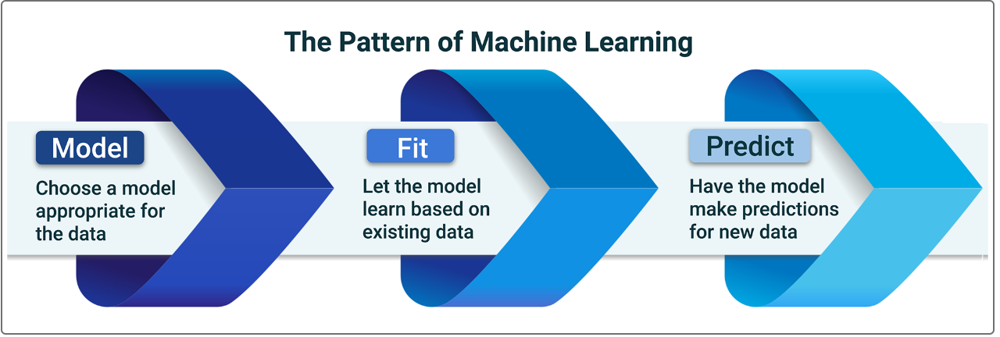
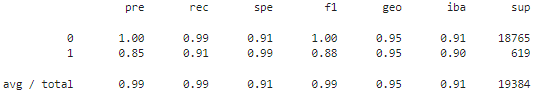

# Loans Credit Quality Prediction

## Overview of the Analysis

In this section, describe the analysis you completed for the machine learning models used in this Challenge. This might include:

- Explain the purpose of the analysis.
- Explain what financial information the data was on, and what you needed to predict.
- Provide basic information about the variables you were trying to predict (e.g., `value_counts`).
- Describe the stages of the machine learning process you went through as part of this analysis.

In this three-stage pattern, we present a machine learning algorithm with data (the model stage), and the algorithm learns from this data (the fit stage) to form a predictive model (the predict stage). A predictive model is simply the resulting model, where the algorithm has mathematically adjusted itself so that it can translate a new set of inputs to the correct output.
 
Model
A model starts as untrained. That is, we haven’t yet adjusted it to make sense of the data.

Fit
The fit stage (also known as the training stage) is when we fit the model to the data. This is when the model starts to learn how to adjust (or train) itself to make predictions matching the data that we give it.

Predict
Once the model has been fit to the data (that is, trained), we can use the trained model to predict new data. If we give the model new data that’s similar enough to the data that it’s gotten before, it can guess (or predict) the outcome for that data.

Evaluate 4. Evaluate the model with accuracy_score(). Now, it’s your turn to apply what you learned about the preceding steps to a dataset that involves financial payments. The goal is to predict which payments are fraudulent and which aren’t.
But, we also want to know the percentage of predictions that the model gets right and how well it predicts each outcome.
To help answer these questions, we can use the following four metrics to give us additional insight into the model’s performance:
• Accuracy
• Precision
• Recall
• F1 score

- Briefly touch on any methods you used (e.g., `LogisticRegression`, or any resampling method).

## Results

This section evaluates and compares the performance of our two models by assessing how the models scored on different criteria. 
Our analysis centers on: 

- Accuracy
- Precision (classification report - pre)
- Recall (classification report - rec)
- F1 score (classification report - f1) 

  Note: in the classification reports 0 represents the scoring for the good quality loans, while 1 is addressing the near-default loans assessment. 

> **Machine Learning Model 1:** 

- Accuracy score: 0.9520479254722232 
- Classification report: 
   

- Explanation of Model 1 Accuracy, Precision, Recall and F1 scores. 

1. `Imbalanced Classes`:  It is important to mention that the data is strongly imbalanced with healthy loans (0) accounting for about 97% of all the loans in the dataset. That can lead to the model giving good preditioctions when it comes to the healthy loans and missing the loans that are close to default.  
2. `Accuracy`: Logistic regression model applied to the original data performed quite well on the accuracy scoring 0.95. That means the the model was able to detect true positives and true negatives (identifying the actual good and actual close to default loans). 
3. `Precision`:  As expected due to imbalances the precision measure for the healthy loans is very good (1), translating into a very high likelihood that the loan identified as health is in fact health. The score is much lower for the bad loans (0.85) meaning that the model is not as good at detecting the loans that are actually close to default (563 actual out of 665 predicted). 
4. `Recall`:   Here again the recall for the healthy loans is very high at 0.99 reflecting the ability of the model to correctly classify true healthy loans. The model performed somewhat lower on the recall for the imbalanced default aproaching loans scoring 0.91 (563 predicted out of 619 true actual bad loans). 
5. `F1`:  As F1 is just a single summary statistic for precision and recall, the F1 score for healthy loan is as high as 1, while the score for the near-default loans is 0.88

> **Machine Learning Model 2:** 

- Accuracy score: 0.9936781215845847 
- Classification report: 
   
- Explanation of Model 2 Accuracy, Precision, Recall and F1 scores. 

1. `Imbalanced Classes`:  We eliminated the effect of imbalanced data by applying the the random oversampler model.  
2. `Accuracy`: Logistic regression model applied to the resampled data improved on the accuracy scoring almost 1 (0.994). That means the the model was able to detect true positives and true negatives even better than the one trainded on the original dataset. 
3. `Precision`:  The precision measure for the healthy loans remained at 1, translating into a very high likelihood that the loan identified as health is in fact health. The score decreased slightly for the bad loans (0.84 from 0.85) making the model even less accurate at reaching the conclusion that the loan identified as a low quality is actually a close to default loan (615 actual out of 731 predicted). 
4. `Recall`:   Here again the recall for the healthy loans is very high at 0.99 reflecting the ability of the model to correctly classify true healthy loans. The model improved also on its ability to correctly identify actual bad quality loans, scoring 0.99 on recall (615 predicted out of 619 true actual bad loans). 
5. `F1`:  F1 has also improved for the bad loans reaching 0.91 compared to 0.88 before resampling.

## Summary

Summarize the results of the machine learning models, and include a recommendation on the model to use, if any. For example:

- Which one seems to perform best? How do you know it performs best?
- Does performance depend on the problem we are trying to solve? (For example, is it more important to predict the `1`'s, or predict the `0`'s? )

If you do not recommend any of the models, please justify your reasoning.
